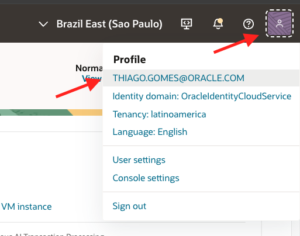
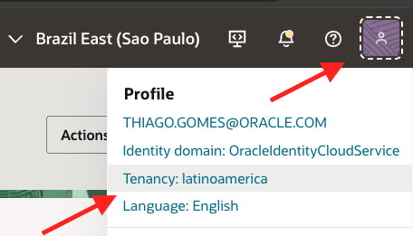
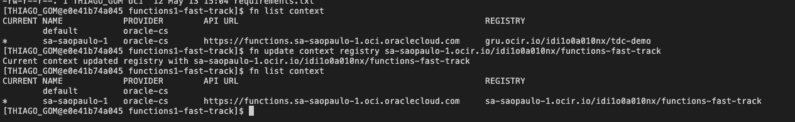

# 🚀 OCI Fast Track Hands-On
Este repositório contém um Lab prático de OCI, criado para demonstrar, de forma simples e progressiva, como provisionar uma arquitetura cloud com a fundação de inraestrutura, máquina virtual, banco de dados, storage, events service e functions. 

---

## 🎯 Objetivo

Ao final deste hands-on, você terá construído uma arquitetura funcional na OCI.

---

## 🛠️ Arquitetura Proposta


---

## ⚙️ Configuração

### 1. Oracle Cloud Infrastructure

1. Acesse [https://cloud.oracle.com/] e faça login
2. Acesse o canto superior direito "PROFILE" →  Identity Domain →  Compartments = "Create Compartment"
3. Criação de componentes de Redes: **Menu Principal → Networking →  Virtual Cloud Networks**
   - Actions: 'Start VCN Wizard'
   - Connection Type: 'Create VCN with Internet Connectivity'
   - Examples: VCN Name(vcn-fast-track), VCN IPv4 CIDR block(10.0.0.0/16), Public Subnet CIDR block(10.0.0.0/24), Private Subnet CIDR block(10.0.1.0/24)
4. Revisão e Criação VCN, Subnets, Route Table, Gateways e Security List

---
### 1.1 Máquina Virtual (VM)

1. Criação de Máquina Virtual: **Menu Principal → Compute → Instances**
   - Create Instance
   - Examples: instance-fast-track, Image And Shape (Flex), Networking(VCN e Subnet criadas no passo anterior), Add SSH keys (Generate a key pair for me) and Download private key & public key
   - Storage (Nesse Lab não é necessário criar Block volumes)
   - Review e Create
2. O acesso a VM será feito via **Canto Superior Direito ao Lado da Region → Developer Tools → Cloud Shell**
 - Com o Cloud Shell aberto, selecionar ícone de engrenagem "Cloud Shell Menu" e fazer o UPLOAD das duas chaves ssh(private e public)
 - Conferir se as chaves ssh estão aparecendo "ls -la"
 - Rodar comando "chmod 600 ~/{chave-privada.key}" Exemplo : chmod 600 ~/ssh-key-fast-track-private.key
 - Acesso VM, rode o comando ssh -i ~/{chave-privada.key} opc@<PUBLIC_IP_VM> Exemplo: ssh -i ~/ssh-key-fast-track-private.key opc@147.15.25.7
 - Atualize a VM com o comando : sudo dnf update -y
 - Instale os pacotes básicos : sudo dnf install -y git wget curl unzip vim nano jq tar firewalld python3 python3-pip python3-devel gcc mysql-server
 - Execute os comandos para liberação de algumas regras : 
   - sudo systemctl enable --now mysqld
   - sudo systemctl enable --now firewalld
   - sudo firewall-cmd --permanent --add-port=5000/tcp
   - sudo firewall-cmd --reload
- Valide se deu certo, executando os seguintes comandos :
   - sudo systemctl status mysqld
   - sudo systemctl status firewalld
   - sudo firewall-cmd --list-ports (O esperado nesse comando é 5000/tcp)

---
### 1.2 Object Storage (Bucket)
1. Criação de Object Storage **Menu Principal → Storage → Object Storage & Archive Storage → Bucket**
   - Create Bucket
   - Examples: Bucket Name (bucket-fast-track), Default Storage Tier (Standard), Create

---
### 1.3 MySQL(Database)
1. Criação do database MySQL **Menu Principal → Databases → MySQL HeatWave → DB systems**
   - Create DB system
   - Examples : Db Name (mysql-fast-track), Template (Development or testing), Create administrator credentials (salve as credenciais), Setup (Standalone)

---
### 1.4 Functions
Antes de criarmos a functions, será preciso gerar um Auth Token e Montar o comando de Login no OCIR

1. Geração Auth Token para login no OCIR 
Antes de fazer o deploy da Function, precisamos autenticar o Docker no OCIR, que é o Oracle Cloud Infrastructure Registry.

Criação Auth Token


- My profile → Tokens and keys
- Auth tokens → Generate token (Copie o token gerado e salve temporariamente, porque ele será exibido apenas uma vez)

Importante: esse token será usado como senha no docker login. Não use a senha da Console OCI.

2. Montar o comando de login no OCIR
O formato do login é: 

docker login -u '<NAMESPACE>/<IDENTITY_DOMAIN>/<USUARIO>' <REGION_KEY>.ocir.io

por exemplo: docker login -u 'idi1o0a010nx/OracleIdentityCloudService/thiago.gomes@oracle.com' gru.ocir.io

Para pegar os dados e montar url: 


- Governance & Administration → Account Management → Tenancy Details → Object storage namespace
- **Profile → Identity & Security → Identity → Domains**
- Para region seguir essa doc → https://docs.oracle.com/pt-br/iaas/Content/Registry/Concepts/registryprerequisites.htm?
   - Exemplo: gru.ocir.io, vcp.ocir.io e etc 

---
Após montar url e gravar token, vamos seguir o passo a passo abaixo:

3. Criação da Functions **Menu Principal → Developer Services → Functions → Applications **
   - Create application
   - Examples : Name(functions-fast-track), Compartment & VCN & Subnet(Public), Shape GENERIC_ARM
   - Selecionar Functions e Create in code editor

Após abrir o code editor, no terminal valide algumas ferramentas:
   - fn --version
   - docker --version
   - oci --version

Fazer Login no OCIR
   - docker login -u 'idi1o0a010nx/OracleIdentityCloudService/thiago.gomes@oracle.com' sa-saopaulo-1.ocir.io
   - Token 
   - retorno esperado 
   - Crie uma pasta limpa para a Function : mkdir -p ~/oci-fast-track-functions
      - cd ~/oci-fast-track-functions
   - Crie a Functions: fn init --runtime python functions1-fast-track
   - Entre na pasta da Functions: cd functions1-fast-track
   - Liste os arquivos: ls -la
      - Retorno esperado: func.py, func.yaml, requirements.txt
   - Liste os contextos existentes: fn list context
      - crie o contexto da região, caso ainda não exista: fn create context sa-saopaulo-1 --provider oracle
      - use o contexto: fn use context sa-saopaulo-1
   - Atualizar o registry: fn update context registry sa-saopaulo-1.ocir.io/idi1o0a010nx/functions-fast-track
      - Confira se atualizou: 
      - Valide o contexto completo: fn inspect context (veja se já existe o campo:oracle.compartment-id)
         - Se não estiver, rode : fn update context oracle.compartment-id <OCID_DO_COMPARTMENT>
   - Realize o Login novamente: docker login -u 'idi1o0a010nx/OracleIdentityCloudService/thiago.gomes@oracle.com' sa-saopaulo-1.ocir.io
   - Confirme o nome da Function no func.yaml : cat func.yaml
   - Agora rode o deploy usando o nome exato da sua Application: fn -v deploy --app functions-fast-track
      - 
      - Valide : fn list functions functions-fast-track
   - Teste a function: fn invoke <NOME_DA_APPLICATION> <NOME_DA_FUNCTION>, por exemplo : fn invoke functions-fast-track functions1-fast-track
      - 

---
### 1.5 Validação Conectividade da VM com o MySQL
Nesta etapa, vamos validar se a VM consegue acessar o MySQL Database System pela rede privada da OCI.

1. Liberação da porta 3306 para acesso da VM ao MySQL : **Menu Principal → Networking → Virtual Cloud Networks → VCN Criada → Subnets → Subnet Private → Security → Security Lists → Security Rules **
   - Ingress Rules → Add Ingress Rules
      - Source Type: CIDR, Source CIDR: 10.0.0.0/16(VCN), IP Protocol: TCP, Destination Port Range: 3306
      - Regra Configurada: Ela permite que qualquer recurso dentro da VCN, incluindo sua VM na subnet pública 10.0.1.0/24, acesse o MySQL na porta 3306.

2. Acesso a VM via cloud shell : ssh -i ~/ssh-key-fast-track-private.key opc@147.15.25.7
3. Dentro da VM rode os comandos:
   - sudo dnf install -y nmap-ncat
   - nc -vz <IP_DB_MY_SQL> 3306 ex: nc -vz 10.0.0.194 3306
   - retorno esperado: 
   - verifique versão do MySQL: mysql --version

4. Conexão: mysql -h 10.0.0.194 -P 3306 -u <ADMIN_USER> -p
   - exemplo: mysql -h 10.0.0.194 -P 3306 -u thiaagomes -p + senha
   - retorno esperado: 
   - Teste : SHOW DATABASES;

---
### 1.6 Criar Schema e Tabela MySQL
Dentro do MySQL iremos criar um DB para o Lab e uma Tabela para armazenar os arquivos processados. 

Sugestão do modelo lógico:
Database: fast_track_db
Tabela: bucket_files

Campos:
- id
- bucket_name
- object_name
- object_url
- event_time
- created_at

1. A tabela vai armazenar metadados do arquivo, não o arquivo em si. O arquivo continua no Object Storage. O MySQL guarda a referência para ele.
- Comando SQL: 

```
CREATE DATABASE IF NOT EXISTS fast_track_db;

USE fast_track_db;

CREATE TABLE IF NOT EXISTS bucket_files (
    id INT AUTO_INCREMENT PRIMARY KEY,
    bucket_name VARCHAR(255) NOT NULL,
    object_name VARCHAR(1024) NOT NULL,
    object_url VARCHAR(2048),
    event_time VARCHAR(100),
    created_at TIMESTAMP DEFAULT CURRENT_TIMESTAMP
);

```
2. Depois faça um teste manual: 

```

INSERT INTO bucket_files (
    bucket_name,
    object_name,
    object_url,
    event_time
) VALUES (
    'bucket-fast-track',
    'teste-manual.txt',
    'https://objectstorage.sa-saopaulo-1.oraclecloud.com/n/<NAMESPACE>/b/bucket-fast-track/o/teste-manual.txt',
    NOW()
);

```

3. Valide: SELECT * FROM bucket_files;
   - retorno esperado: 

---
### 1.8 Function Gravando no MySQL com payload manual
Primeiro passo é abrir a pasta da Function no Code Editor 

1. No terminal, caso você não esteja na pasta, acesse ela por exemplo: cd ~/oci-fast-track-functions/functions1-fast-track
   - Valide se está na pasta correta : ls -la
      - Você precisa ver estes arquivos : func.py, func.yaml, requirements.txt

2. Atualizar o requirements.txt
   - No terminal do Code Editor rode: 
   ```
   cat > requirements.txt <<'EOF'
   fdk>=0.1.113
   PyMySQL==1.1.1
   EOF
   ```
   - Valide: cat requirements.txt
      - retorno esperado : fdk>=0.1.113, PyMySQL==1.1.1

3. Atualizar o func.py, iremos inserir um código simples que recebe um JSON via fn invoke, Lê bucket_name, object_name, object_url e event_time, Conecta no MySQL, Insere na tabela  fast_track_db.bucket_files e por fim retorna um response JSON
   - Através da UI do Code Editor edite o arquivo 
   - Atualizar a Version no func.yaml por exemo: version: 0.0.5

4. Depois de Salvar o Arquivo execute o comando: fn -v deploy --app <NOME_FUNCTIONS> por exemplo: fn -v deploy --app functions-fast-track
   - Retorno esperado: 
   - No terminal do Code Editor rode: fn list functions <NOME_FUNCTIONS> por exemplo fn list functions functions-fast-track

5. Invocar a Function com payload manual:

   ```
   echo '{
     "bucket_name": "bucket-fast-track",
     "object_name": "arquivo-via-function.txt",
     "object_url": "https://objectstorage.sa-saopaulo-1.oraclecloud.com/n/idi1o0a010nx/b/bucket-fast-track/o/arquivo-via-function.txt",
     "event_time": "2026-05-13T18:45:00Z"
   }' | fn invoke functions-fast-track functions1-fast-track

   ```
6. Resultado esperado : 

---
### 1.9 Validar no MySQL pela VM

1. Volte para VM: ssh -i ~/ssh-key-fast-track-private.key opc@147.15.25.7
2. Conecte no MySQL: mysql -h 10.0.0.194 -P 3306 -u thiaagomes -p
3. Dentro do MySQL: 
   - USE fast_track_db;

   SELECT id, bucket_name, object_name, object_url, event_time, created_at
   FROM bucket_files
   ORDER BY id DESC;

4. Retorno esperado: 

---
### 1.10 Criação do Events Service para invocar Functions

1. Criação do Events Service **Menu Principal → Observability & Management → Events Service → Rules**
   - Create Rule: Display name(EventsFastTrack), Rule conditions & Actions:
      - 
      - Depois Inserir mais uma Conditions em Attributes: bucketName e inserir o nome do Bucket em Values

---
### 1.11 Teste de envio de arquivo no Object Storage
Agora iremos enviar um arquivo, para que seja testado o Events Service invocando a functions para que ela grave o metadado no MySQL

1. Inserindo arquivo no Object Storage (Bucket): **Menu Principal → Storage → Object Storage & Archive Storage → Bucket**
   - Pesquise o Bucket → Vá em Objects → Upload objects → Drop a file or select one
   - Habilitar logs na Function para verificar se houve invoke